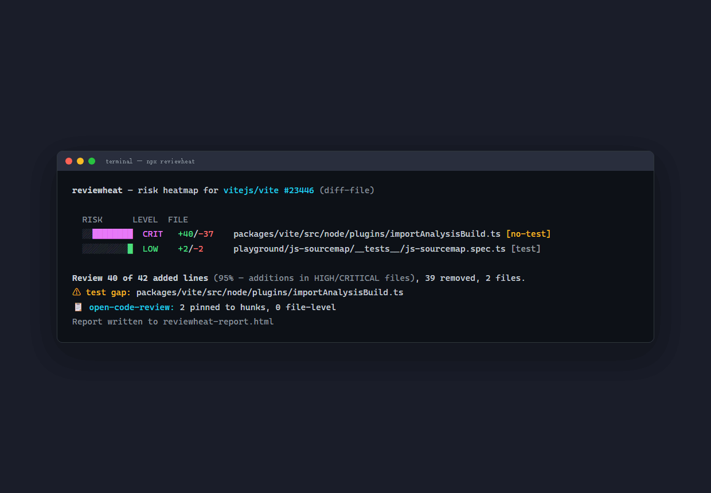

# reviewheat

<p align="center">
  
</p>

**Your agents write 80% of the code. Review it in 10% of the time.**

`reviewheat` turns any pull request into a **risk heatmap**: which files and hunks contain real
behavioral change, where test coverage is thin, and what deserves the human's attention.
It writes no review comments — it shows you where to look.

> **What it is NOT:** reviewheat does not judge whether code is *correct*. Compilers catch
> syntax; humans and AI reviewers judge semantics. reviewheat sits above both: it ranks where
> that judgment should be spent first — like triage at an ER, not diagnosis.

> 🚧 Work in progress — v0.1 lands soon. Star or watch to get notified.

## Why

AI coding agents (Copilot, Claude Code, Cursor, ...) now generate most pull requests. Reviewing
AI output line-by-line does not scale, and AI reviewers (CodeRabbit, pr-agent,
[open-code-review](https://github.com/alibaba/open-code-review)) respond with *even more comments*.
The bottleneck of 2026 is **human review capacity**, not comment precision.

`reviewheat` attacks the other side of the problem: compress what a human must read.

## How it works

Three layers, zero-config by default:

1. **Deterministic heuristics** (default — offline, no API key)
   Parses the diff and scores every hunk: behavioral change vs. cosmetic churn, complexity delta,
   test co-change detection, path-based risk.
2. **LLM behavior classification** (`--llm`, optional)
   Bring your own key — any OpenAI-compatible API or a local model — to classify the hunks the
   heuristics flag as ambiguous.
3. **Reviewer overlay** (`--ocr`, shipped)
   Ingest JSON output from open-code-review (or pr-agent) and pin existing findings onto the
   heatmap. `reviewheat` is the visual triage layer *on top of* your reviewer — not another
   commenting bot.

Output: a self-contained HTML report (heatmap by file → hunk, test-gap overlay), a terminal
summary, and an optional CI gate (`--fail-on high` exits 1 when high-risk hunks lack tests).

## Usage (planned)

```bash
npx reviewheat                    # analyze uncommitted changes / last commit
npx reviewheat --diff-file pr.diff # analyze any unified diff file
npx reviewheat --ocr ocr.json     # overlay open-code-review findings onto the heatmap
npx reviewheat --with-ocr         # one command: run `ocr review` itself, then overlay
npx reviewheat --llm              # classify ambiguous hunks with an LLM (BYO key, Ollama works)
npx reviewheat --tests            # generate test-file suggestions for red zones
npx reviewheat --fail-on high     # CI gate
```

## The pitch

You get a 900-line PR from your coding agent. `npx reviewheat` tells you: 874 lines are green
(formatting, renames, churn), 26 lines are red — real logic changes that no test touches.
Review the 26, generate targeted tests for them, merge.

## Roadmap

- [ ] v0.1 — diff parser + heuristic scoring + terminal summary
- [ ] v0.2 — self-contained HTML heatmap report
- [ ] v0.3 — `--ocr` overlay (open-code-review JSON)
- [ ] v0.4 — `--llm` classification + targeted test generation for red zones
- [ ] v0.5 — GitHub Action + `--pr` mode
- [ ] v0.6 — standalone binaries (macOS / Linux / Windows, no Node required)

## License

MIT
